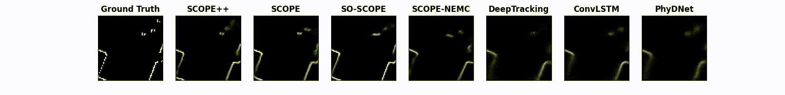
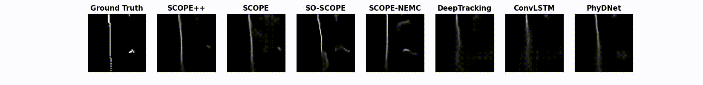
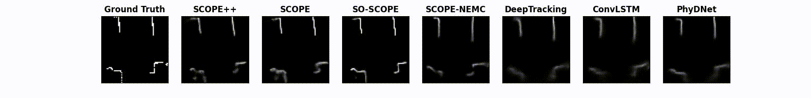

# SCOPE: Stochastic Cartographic Occupancy Prediction Engine for Uncertainty-Aware Dynamic Navigation

Implementation code for our paper  ["SCOPE: Stochastic Cartographic Occupancy Prediction Engine for Uncertainty-Aware Dynamic Navigation"](https://doi.org/10.1109/TRO.2025.3578234) [[arXiv](https://arxiv.org/abs/2407.00144.pdf)]. 
Video demos can be found at [multimedia demonstrations](https://youtu.be/xJBtWQDLU04).
A series of deep neural network-based Stochastic Cartographic Occupancy Prediction Engines (i.e., scope++, scope, and so-scope) are implemented by the Pytorch. 
Here are three GIFs showing the occupancy grid map prediction comparison results (0.5s, or 5 time steps into the future) of our proposed scope++, scope, and so-scope algorithms, and ConvLSTM, PhyDNet, DeepTracking, and scope-NEMC baselines on three different datasets with different robot models.
* OGM-Turtlebot2: 
 
* OGM-Jackal: 
 
* OGM-Spot: 
 

## Notice
Note that in our previous CoRL paper ["Stochastic Occupancy Grid Map Prediction in Dynamic Scenes"](https://openreview.net/pdf?id=fSmkKmWM5Ry)([arXiv](https://arxiv.org/abs/2210.08577)), we used the acronym SOGMP (Stochastic Occupancy Grid Map Predictor) instead of SCOPE. The scope and scope++ algorithms were SOGMP and SOGMP++ in our previous GitHub repository [SOGMP](https://github.com/TempleRAIL/SOGMP).

## Requirements
* python 3.7
* torch 1.7.1
* tensorboard

## OGM-Datasets
The related datasets can be found at: https://doi.org/10.5281/zenodo.7051560. 
There are three different datasets collected by three different robot models (i.e., Turtlebot2, Jackal, Spot).
* 1.OGM-Turtlebot2: collected by a simulated Turtlebot2 with a maximum speed of 0.8 m/s navigates around a lobby Gazebo environment with 34 moving pedestrians using random start points and goal points
* 2.OGM-Jackal: extracted from two sub-datasets of the socially compliant navigation dataset (SCAND), which was collected by the Jackal robot with a maximum speed of 2.0 m/s in the outdoor environment of the UT Austin
* 3.OGM-Spot: extracted from two sub-datasets of the socially compliant navigation dataset (SCAND), which was collected by the Spot robot with a maximum speed of 1.6 m/s at the Union Building of the UT Austin

## Usage: so-scope (Fastest inference speed, can be deployed on resource-limited robots and combined with other learning-based algorithms)
* Download OGM-datasets from https://doi.org/10.5281/zenodo.7051560 and decompress them to the home directory:
```Bash
cd ~
tar -zvxf OGM-datasets.tar.gz
```
* Training:
```Bash
git clone https://github.com/TempleRAIL/scope.git
cd scope 
git checkout so-scope
sh run_train.sh ~/data/OGM-datasets/OGM-Turtlebot2/train ~/data/OGM-datasets/OGM-Turtlebot2/val
```
* Inference Demo on OGM-Turtlebot2 dataset: 
```Bash
git clone https://github.com/TempleRAIL/scope.git
cd scope 
git checkout so-scope
sh run_eval_demo.sh  ~/data/OGM-datasets/OGM-Turtlebot2/test
```

## Usage: scope (The inference speed is faster than scope++)
* Download OGM-datasets from https://doi.org/10.5281/zenodo.7051560 and decompress them to the home directory:
```Bash
cd ~
tar -zvxf OGM-datasets.tar.gz
```
* Training:
```Bash
git clone https://github.com/TempleRAIL/scope.git
cd scope 
git checkout scope
sh run_train.sh ~/data/OGM-datasets/OGM-Turtlebot2/train ~/data/OGM-datasets/OGM-Turtlebot2/val
```
* Inference Demo on OGM-Turtlebot2 dataset: 
```Bash
git clone https://github.com/TempleRAIL/scope.git
cd scope 
git checkout scope
sh run_eval_demo.sh  ~/data/OGM-datasets/OGM-Turtlebot2/test
```

## Usage: scope++ (The prediction accuracy is higher than scope)
* Download OGM-datasets from https://doi.org/10.5281/zenodo.7051560 and decompress them to the home directory:
```Bash
cd ~
tar -zvxf OGM-datasets.tar.gz
```
* Training:
```Bash
git clone https://github.com/TempleRAIL/scope.git
cd scope 
git checkout scope++
sh run_train.sh ~/data/OGM-datasets/OGM-Turtlebot2/train ~/data/OGM-datasets/OGM-Turtlebot2/val
```
* Inference Demo on OGM-Turtlebot2 dataset: 
```Bash
git clone https://github.com/TempleRAIL/scope.git
cd scope 
git checkout scope++
sh run_eval_demo.sh  ~/data/OGM-datasets/OGM-Turtlebot2/test
```

## Citation
```
@ARTICLE{xiw2025scope,
  author={Xie, Zhanteng and Dames, Philip},
  journal={IEEE Transactions on Robotics}, 
  title={SCOPE: Stochastic Cartographic Occupancy Prediction Engine for Uncertainty-Aware Dynamic Navigation}, 
  year={2025},
  volume={41},
  number={},
  pages={4139-4158},
  doi={10.1109/TRO.2025.3578234}
}

@inproceedings{xie2023sogmp,
  doi = {10.48550/ARXIV.2210.08577},
  title={Stochastic Occupancy Grid Map Prediction in Dynamic Scenes},
  author={Zhanteng Xie and Philip Dames},
  booktitle={Proceedings of The 7th Conference on Robot Learning},
  pages={1686--1705},
  year={2023},
  volume={229},
  series={Proceedings of Machine Learning Research},
  month={06--09 Nov},
  publisher={PMLR},
  url={https://proceedings.mlr.press/v229/xie23a.html}
}

```
